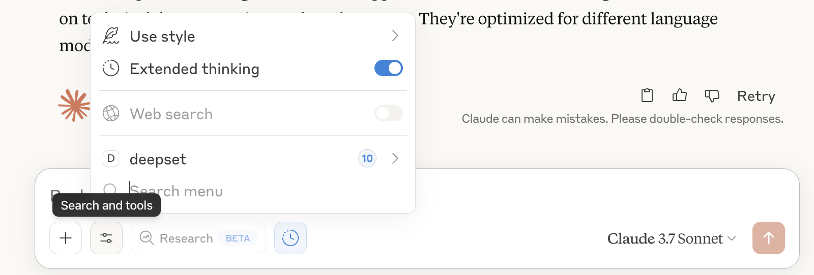

# MCP Server for the deepset AI platform

The deepset MCP server exposes tools that MCP clients like Claude or Cursor can use to interact with the deepset AI platform.
Use these tools to develop pipelines, or to get information about components and how they are defined.


## Usage

### Claude Desktop App

**Prerequisites:**
- [Claude Desktop App](https://claude.ai/download) needs to be installed
- You need to be on the Claude Pro, Team, Max, or Enterprise plan
- You need an installation of [Docker](https://docs.docker.com/desktop/) (scroll down to the `uv` section if you want to use `uv` instead of Docker)
- You need an [API key](https://docs.cloud.deepset.ai/docs/generate-api-key) for the deepset platform

**Steps:**
1. Go to: `/Users/your_user/Library/Application Support/Claude` (Mac)
2. Either open or create `claude_desktop_config.json`
3. Add the following json as your config (or update your existing config if you are already using other MCP servers)

```json
{
  "mcpServers": {
    "deepset": {
      "command": "/usr/local/bin/docker",
      "args": [
        "run",
        "-i",
        "-e",
        "DEEPSET_WORKSPACE",
        "-e",
        "DEEPSET_API_KEY",
        "deepset/deepset-mcp-server:main"
      ],
      "env": {
       "DEEPSET_WORKSPACE":"<WORKSPACE>",
       "DEEPSET_API_KEY":"<DEEPSET_API_KEY>"
     }

    }
  }
}
```

4. Quit and start the Claude Desktop App
5. The deepset server should appear in the "Search and Tools" menu (this takes a few seconds as the Docker image needs to be downloaded and started)




**(Optional) Running the server with uv instead of Docker**

Running the server with uv gives you faster startup time and consumes slightly less resources on your system.

1. [Install uv](https://docs.astral.sh/uv/guides/install-python/) if you don't have it yet
2. Clone the [deepset-mcp-server repository](https://github.com/deepset-ai/deepset-mcp-server)
3. Put the following into your `claude_desktop_config.json`

```python
{
  "mcpServers": {
    "deepset": {
      "command": "/opt/homebrew/bin/uv", # path to your uv installation
      "args": [
        "--directory",
        "/path/to/your/clone/of/deepset-mcp-server", # path to your clone of the deepset-mcp-server repo 
        "run",
        "deepset-mcp"
      ],
      "env": {
       "DEEPSET_WORKSPACE":"<WORKSPACE>",
       "DEEPSET_API_KEY":"<DEEPSET_API_KEY>"
     }

    }
  }
}
```

4. Quit and start the Claude Desktop App


### Other MCP Clients

The repo was not tested with other MCP clients but tools like Cursor or the Haystack MCP tools should work out of the box.


## Further improvements ideas

- remove hardcoded workspace
- expose standard prompts via MCP e.g., for debugging, fixing pipelines, reading logs etc
- fix the docker run command to clear cache
- the ability to dump the conversation of improving the copilot
- test with different models not just Claude Sonnet 3.7
- test with different clients other than Claude Desktop app


