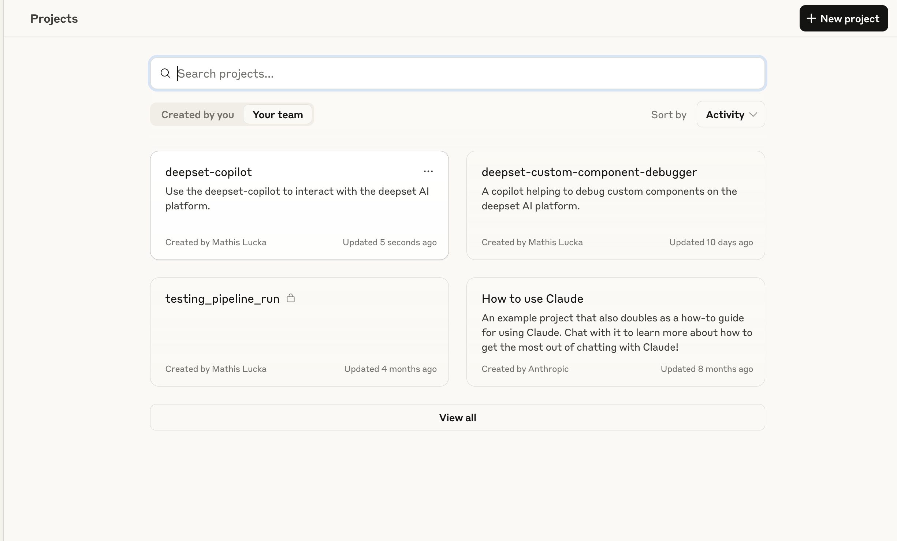

# MCP Server for the deepset AI platform

The deepset MCP server exposes tools that MCP clients like Claude or Cursor can use to interact with the deepset AI platform.
Use these tools to develop pipelines, or to get information about components and how they are defined.


## Installation

### Claude Desktop App

**Prerequisites:**
- [Claude Desktop App](https://claude.ai/download) needs to be installed
- You need to be on the Claude Pro, Team, Max, or Enterprise plan
- You need an installation of [Docker](https://docs.docker.com/desktop/) (scroll down to the `uv` section if you want to use `uv` instead of Docker)
- You need an [API key](https://docs.cloud.deepset.ai/docs/generate-api-key) for the deepset platform

**Steps:**
1. Go to: `/Users/your_user/Library/Application Support/Claude` (Mac)
2. Either open or create `claude_desktop_config.json`
3. Add the following json as your config (or update your existing config if you are already using other MCP servers)

```json
{
  "mcpServers": {
    "deepset": {
      "command": "/usr/local/bin/docker",
      "args": [
        "run",
        "-i",
        "-e",
        "DEEPSET_WORKSPACE",
        "-e",
        "DEEPSET_API_KEY",
        "deepset/deepset-mcp-server:main"
      ],
      "env": {
       "DEEPSET_WORKSPACE":"<WORKSPACE>",
       "DEEPSET_API_KEY":"<DEEPSET_API_KEY>"
     }

    }
  }
}
```

4. Quit and start the Claude Desktop App
5. The deepset server should appear in the "Search and Tools" menu (this takes a few seconds as the Docker image needs to be downloaded and started)


**(Optional) Running the server with uv instead of Docker**

Running the server with uv gives you faster startup time and consumes slightly less resources on your system.

1. [Install uv](https://docs.astral.sh/uv/guides/install-python/) if you don't have it yet
2. Clone the [deepset-mcp-server repository](https://github.com/deepset-ai/deepset-mcp-server)
3. Put the following into your `claude_desktop_config.json`

```python
{
  "mcpServers": {
    "deepset": {
      "command": "/opt/homebrew/bin/uv", # path to your uv installation
      "args": [
        "--directory",
        "/path/to/your/clone/of/deepset-mcp-server", # path to your clone of the deepset-mcp-server repo 
        "run",
        "deepset-mcp"
      ],
      "env": {
       "DEEPSET_WORKSPACE":"<WORKSPACE>",
       "DEEPSET_API_KEY":"<DEEPSET_API_KEY>"
     }

    }
  }
}
```

4. Quit and start the Claude Desktop App


### Other MCP Clients

The repo was not tested with other MCP clients but tools like Cursor or the Haystack MCP package should work out of the box.


## Usage

_Assuming you are using the MCP server through Claude Desktop and you are part of the deepset organization._

**Setup:**
1. Go to "Projects" in Claude Desktop
2. Select the "Your Team"-tab
3. Select the "deepset-copilot" project



The _deepset-copilot_ project contains system instructions that are optimized for the deepset MCP server.

You can also access the system prompt [here](src/deepset_mcp/prompts/deepset_copilot_prompt.md).

The MCP server also exposes the system prompt as the `deepset_copilot`-prompt.
In Claude Desktop you can click on the plus-sign below the chat bar and select "Add from deepset" to add the prompt.
However, this will only load the prompt as text context into your message. It won't set the prompt as system instructions.
Using it via system instructions in Claude Desktop yields better results.

Using these instructions with Claude will help you to create or update pipelines.
You can also ask questions about pipelines in the workspace or get information about components
(e.g. What init params do they accept? What inputs and outputs do they have?).

You can activate and deactivate specific tools in the "Search and tools"-menu that is available below the chat bar.

Claude will ask for your permission before a tool call is executed. You can opt to "allow once", "allow always" or "deny".


**Limitations**

Unfortunately, you need to set the workspace and organization (through the API key) in the `claude_desktop_config.json`.
There is no way to pass the API key dynamically to Claude in a secure way.
The workspace could be passed into the tool call, it's an easy enhancement, but I'd like to get feedback first.


## Further improvements ideas

- expose standard prompts via MCP e.g., for debugging, fixing pipelines, reading logs etc
- fix the docker run command to clear cache
- the ability to dump the conversation of improving the copilot
- test with different clients other than Claude Desktop app


